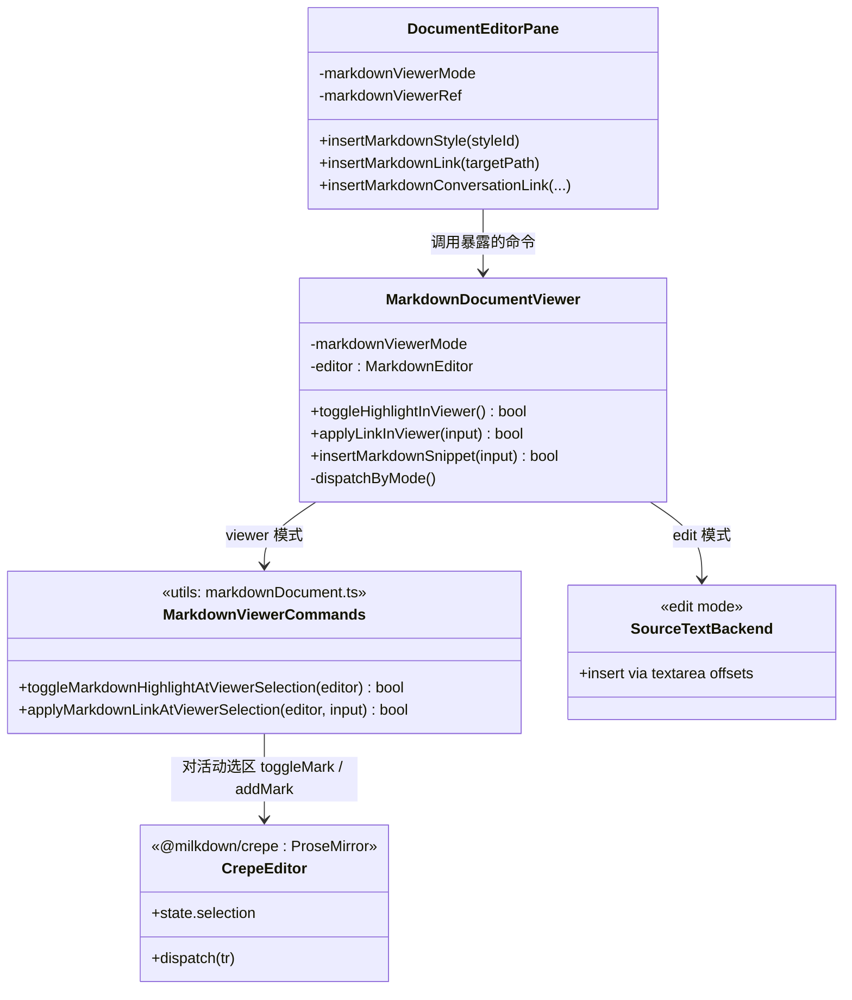

> **语言**: [English](design.md) | 中文

## Context

知识工作区的 Markdown 界面有两种编辑模式，各自背后是不同的模型：
- **viewer** 模式渲染一个活动、可编辑的 Crepe/Milkdown（ProseMirror）文档，选区是 ProseMirror 选区。
- **edit** 模式在 `<textarea>` 中展示原始 Markdown 源码，选区是字符串偏移。

所有插入 / 格式化功能（链接、会话链接、资源/图片、高亮）目前都针对**源码字符串**模型编写。为了让它们在 viewer 模式下生效，`DocumentEditorPane` 做了一条隐藏的 `viewer → edit → viewer` 往返（`runMarkdownInsertion`），并把渲染后的 DOM 选区反向映射回源码偏移（`prepareMarkdownSelectionFromViewer` → `captureRenderableMarkdownSelection` → `resolveMarkdownSourceSelection` + 空块兜底）。

这座桥是两个缺陷的共同根因：编辑成功后视口跳到顶部（模式往返重建编辑器，滚动恢复补丁捕获了错误的值），以及链接落点不准（DOM→偏移映射有损）。一个原型已经证明：直接在活动 ProseMirror 选区上切换 highlight mark 可彻底消除卷屏。

## Goals / Non-Goals

**Goals：**
- 让 viewer 模式的格式化/链接操作直接、就地作用于活动编辑器选区，无模式往返、无编辑器重建。
- 保证 viewer 模式操作的视口保持。
- 让 viewer 模式链接插入精准落在用户的真实选区。
- 序列化 Markdown 与现状完全一致（`==...==`、`[label](href)`）。
- 原始源码（edit）模式行为保持不变。

**Non-Goals：**
- 不改动原始源码 edit 模式的插入机制。
- 本次不新增工具栏动作（加粗/斜体等）——仅迁移高亮与链接/会话链接；架构为后续留出空间。
- 块级节点插入（PDF 嵌入、图片）的完整迁移不在本次范围；在后续之前它们仍走源码路径（inline/block 感知的节点插入作为风险/待办记录）。

## Decisions

### 决策 1：一个语义命令、两个原生后端、按当前界面分发
每个编辑功能只表达一次语义意图，由当前模式的原生后端落地。viewer 模式对活动 `EditorView` 使用 ProseMirror 命令；edit 模式保持既有 textarea 源码路径。分发逻辑位于 `MarkdownDocumentViewer`，以 `props.markdownViewerMode` 为键。

**考虑过的替代方案：** 保留源码往返、仅修补滚动捕获 watcher。从长期看被否决：它保留了有损的偏移映射（链接位置 bug），也保留了模式闪烁。

### 决策 2：高亮通过 `toggleMark` 作用于活动选区（原型，已合入）
- 文件：`packages/ui/src/utils/markdownDocument.ts`
  - 新增 `export function toggleMarkdownHighlightAtViewerSelection(editor: MarkdownEditor): boolean` —— 取 `editorViewCtx`，拿 `schema.marks.highlight`，执行 `toggleMark(markType)(view.state, view.dispatch, view)`。
  - 引入：从 `@milkdown/kit/prose/commands` 导入 `toggleMark`。
- 文件：`packages/ui/src/document-viewers/MarkdownDocumentViewer.vue`
  - 新增 `function toggleHighlightInViewer(): boolean`，并通过 `defineExpose` 暴露。
- 文件：`packages/ui/src/components/DocumentEditorPane.vue`
  - `insertMarkdownStyleSnippetIntoDocument`：viewer 模式调用 `toggleHighlightInViewer()` 并收起 picker；不再往返。

### 决策 3：链接 / 会话链接通过 link mark 作用于活动选区
- 文件：`packages/ui/src/utils/markdownDocument.ts`
  - 新增 `export function applyMarkdownLinkAtViewerSelection(editor: MarkdownEditor, input: { label: string; href: string }): boolean` —— 取 `editorViewCtx`，拿 `schema.marks.link`；若选区非空，对范围 `addMark` 链接（属性 `{ href }`，选中文本即标签）；若折叠，插入文本节点 `label` 并对其施加 link mark；分发单个事务。
- 文件：`packages/ui/src/document-viewers/MarkdownDocumentViewer.vue`
  - 修改 `insertMarkdownLink` / `insertMarkdownConversationLink`，使其在 viewer 模式委派给 `applyMarkdownLinkAtViewerSelection`，而非源码路径。edit 模式保持既有源码插入。
- 文件：`packages/ui/src/components/DocumentEditorPane.vue`
  - 将 viewer 模式下的文档链接与会话链接插入路由到就地命令（去掉这些 viewer 路径上的 `prepareMarkdownSelectionFromViewer` + `runMarkdownInsertion`）。

### 决策 4：集中分发 + 视口保护清理
- 文件：`packages/ui/src/document-viewers/MarkdownDocumentViewer.vue`
  - 引入单一分发面（例如在 `defineExpose` 扩展 `toggleHighlightInViewer` / `applyLinkInViewer`），确保任何暴露的 viewer 命令都不触发模式切换。
  - viewer 操作不再切换模式后，简化模式切换的滚动捕获 watcher（即导致卷屏的 `pendingModeSwitchViewerScrollTop` 覆盖）——仅在离开 viewer 时捕获。
- 文件：`packages/ui/src/components/DocumentEditorPane.vue`
  - 移除已迁移操作在 `runMarkdownInsertion` 的 viewer 分支；edit 模式继续使用它。

### 决策 5：退役 viewer 操作的源码偏移映射
链接插入迁移后，仅服务于 viewer 的辅助函数即成为死代码：`prepareMarkdownSelectionFromViewer`、`captureRenderableMarkdownSelection`、`resolveMarkdownSourceSelection`、`resolveEmptyBlockMarkdownOffset`、`resolveEmptyBlockAnchorFallback`。移除它们及其测试。仅当（延后的）块级节点路径复用时保留 `insertMarkdownAtViewerSelection`；否则用 inline/block 感知的版本替换它。

### 类图

## Risks / Trade-offs

- [Crepe link mark 名称/属性不匹配] → 运行时核对 Crepe 的 link mark 名称（`link`）与必需属性；用 `schema.marks.link` 存在性校验做守卫，缺失时降级为 no-op + 警告（与高亮命令的防御风格一致）。
- [折叠选区的链接语义与源码路径不同] → 明确定义：折叠光标时插入携带 link mark 的 `label` 文本；以 spec 场景与 e2e 用例覆盖。
- [块级片段（PDF/图片）仍走源码路径] → 不在本次范围；在后续补 inline/block 感知节点插入前保留源码路径。作为待办记录，避免偏移映射移除后破坏它们。
- [移除偏移映射辅助函数破坏测试/引用] → 与最后一个 viewer 使用方在同一步移除；跑完整单测 + e2e 确认无回归。
- [markdownUpdated 回声环] → 依赖既有的受 `lastKnownMarkdown` 守卫的 `syncEditorContent`；该路径已支撑"直接在 viewer 打字"，就地命令复用这条已验证的同步通道。

## Migration Plan

1. P1（已做为原型）：高亮通过 `toggleMark`，新旧并存；旧 viewer 兜底暂时注释以便验证。
2. P2：链接 / 会话链接通过 `applyMarkdownLinkAtViewerSelection`；在模式分发下新旧并存。
3. P3（可选/后续）：资源/图片的 inline/block 感知节点插入；迁移这些 viewer 路径。
4. P4：删除源码偏移映射子系统 + viewer 往返；简化滚动 watcher。
5. 更新 `workspace.dsl` 全局类图与 `ARCHITECTURE.zh-CN.md` 以体现命令/后端拆分（归档时把类图合并进全局类图）。

回滚：每个阶段在其 viewer 路径验证通过前保留源码路径；回退某阶段即恢复先前行为，因为分发以操作为粒度。

## Open Questions

- 会话链接与文档链接是否共用一个 `applyMarkdownLinkAtViewerSelection`，还是保留为构造 `{ label, href }` 的薄包装？（倾向：共用一个命令，包装负责构造 href。）
- 在移除偏移映射（P4）之前是否必须先做延后的块级节点路径（P3），还是块级片段可以长期保留一条最小源码路径？
