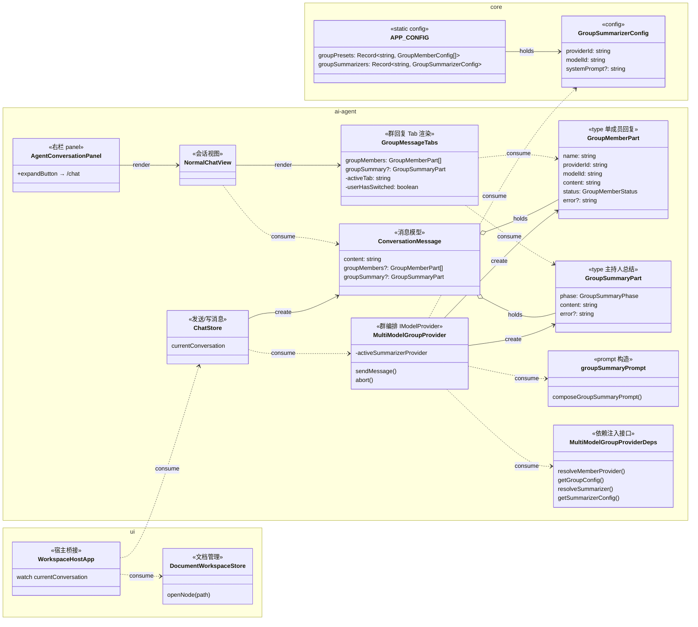

## Context

Group conversation (`MultiModelGroupProvider`) currently merges all member replies into a single assistant message using `### {memberName}` Markdown headings and emits it via the standard `onUpdate({ text })` callback. The chat store writes this merged text directly to `ConversationMessage.content`, and `NormalChatView` renders it with `MarkdownContent`. There is no per-member structure in the message model, no summarization step, and no Tab-based UI.

The existing Compare feature (`CompareChatView` + `AnalysisGrid`) is a useful precedent for side-by-side model output and structured analysis, but it is a separate one-shot A/B workflow — not a multi-turn group conversation. It cannot be reused directly.

The right-panel `AgentConversationPanel` already has an "expand to full-screen" button (`agent-conversation-expand` → `switchWorkspace('/chat')`), but there is no symmetric "collapse to panel" button in the full-screen view. The `Conversation` model already stores `documentIds`, but nothing in the UI layer uses that field to auto-open associated documents on conversation switch.

## Goals / Non-Goals

**Goals:**
- Render group turns as a tabbed card: `Summary` tab (default after completion) + one tab per member.
- Auto-generate a structured summary (consensus / complementary / conflicts) via a preset-configured summarizer model when ≥2 members complete.
- Stream member replies and summarizer output in real time; surface per-member status indicators.
- Single-member turns degrade gracefully to a plain bubble.
- Add a symmetric "collapse to panel" button in the full-screen chat header.
- Auto-open the first associated document (`documentIds[0]`) on conversation/workspace switch.
- All new fields are optional and backward-compatible with existing conversations.

**Non-Goals:**
- Changes to DOM provider chain, group member routing, or `@mention` dispatch logic.
- Multi-round orchestration, auto-planning, or persona templates.
- Modifying the Compare feature.

## Decisions

### D1 — Extend `ConversationMessage` with optional structured fields (additive)

**Decision:** Add optional `groupMembers?: GroupMemberPart[]` and `groupSummary?: GroupSummaryPart` to `ConversationMessage`. Keep `content` as a flattened plaintext fallback for search/export/legacy rendering.

**Rationale:** Avoids a wrapper container type; any message without these fields renders via the existing `MarkdownContent` path unchanged. Storage size increase is acceptable.

**Alternative considered:** A new `GroupConversationMessage` subtype — rejected because it would require discriminated-union handling everywhere messages are consumed (chat store, search, export, history serialization).

**Files changed:**
- `plugins/ai-agent/src/interfaces/Conversation.ts` — add `groupMembers?` and `groupSummary?` to `ConversationMessage`
- `plugins/ai-agent/src/interfaces/IModelProvider.ts` — add same optional fields to `ProviderStreamUpdate` and `ProviderSendResult`

**Signatures:**
```ts
// Conversation.ts
export type GroupMemberStatus = 'pending' | 'streaming' | 'done' | 'error';
export type GroupSummaryPhase = 'waiting' | 'streaming' | 'done' | 'error';

export interface GroupMemberPart {
  name: string;
  providerId: string;
  modelId: string;
  content: string;
  status: GroupMemberStatus;
  error?: string;
}

export interface GroupSummaryPart {
  phase: GroupSummaryPhase;
  content: string;
  error?: string;
}

// ConversationMessage gains:
groupMembers?: GroupMemberPart[];
groupSummary?: GroupSummaryPart;
```

---

### D2 — `MultiModelGroupProvider` builds and streams `groupMembers[]` inline

**Decision:** Replace the current per-member text buffer (`Map<string, string>`) with a `GroupMemberPart[]` array that flows through `onUpdate`. After `Promise.all(memberTasks)`, if members ≥2, resolve the preset summarizer and stream its output into `groupSummary`.

**Files changed:**
- `plugins/ai-agent/src/providers/model/MultiModelGroupProvider.ts` — refactor `sendMessage`, add summarizer invocation
- `plugins/ai-agent/src/group/groupTypes.ts` — add `GroupMemberPart`, `GroupSummaryPart` (also exported from `Conversation.ts` interfaces)
- `plugins/ai-agent/src/group/groupSummaryPrompt.ts` (new) — compose summarizer prompt
- `plugins/ai-agent/src/runtime/createModelProviderRuntime.ts` — inject `resolveSummarizer` dependency; update `getGroupConfig` return type

**Key method signatures:**
```ts
// MultiModelGroupProviderDeps (groupTypes.ts or groupProvider deps)
interface MultiModelGroupProviderDeps {
  resolveMemberProvider(providerId: string): IModelProvider;
  getGroupConfig(presetModelId?: string): GroupConfig;
  resolveSummarizer(presetModelId?: string): IModelProvider | null; // null = no summarizer
  getSummarizerConfig(presetModelId?: string): GroupSummarizerConfig | null;
}

// groupSummaryPrompt.ts
export function composeGroupSummaryPrompt(
  members: GroupMemberPart[],
  systemPrompt?: string
): string;
```

**Abort:** `abort()` cancels all running member providers AND the summarizer provider via a shared `AbortController`-style flag (matching existing pattern in `activeMemberProviders`).

---

### D3 — Preset-level summarizer config in `APP_CONFIG`

**Decision:** Add `groupSummarizers: Record<presetId, GroupSummarizerConfig>` to `APP_CONFIG` in `packages/core/config.ts`, parallel to `groupPresets`.

```ts
// packages/core/config.ts
export interface GroupSummarizerConfig {
  providerId: string;
  modelId: string;
  systemPrompt?: string;
}
// APP_CONFIG gains:
groupSummarizers: Record<string, GroupSummarizerConfig>;
```

**Rationale:** Keeps summarizer tied to the preset (swap preset → swap summarizer), zero extra UI.

---

### D4 — `GroupMessageTabs.vue` as a new rendering component

**Decision:** Create a new `GroupMessageTabs.vue` component consumed by `NormalChatView` when `message.groupMembers?.length > 0` (and `> 1` for showing the Summary tab).

**Files changed / created:**
- `plugins/ai-agent/src/components/GroupMessageTabs.vue` (new)
- `plugins/ai-agent/src/views/NormalChatView.vue` — conditional render

**`GroupMessageTabs` props/behavior:**
```ts
defineProps<{
  groupMembers: GroupMemberPart[];
  groupSummary?: GroupSummaryPart;
}>();
```
- Local `activeTab: string` (member name or `'summary'`).
- Default on mount: first member's name.
- Watch `groupSummary.phase`: when it transitions to `'done'` and `userHasSwitched === false`, set `activeTab = 'summary'`.
- `@member` chip click: `activeTab = memberName`.
- Summary tab hidden (no chip rendered) when `groupMembers.length === 1`.
- Degradation: when `groupMembers.length === 1`, `NormalChatView` renders a plain `MarkdownContent` bubble using `groupMembers[0].content` (not `GroupMessageTabs`).

---

### D5 — Symmetric panel ↔ full-screen toggle

**Decision:** Add a "collapse to panel" button in the full-screen chat header (`NormalChatView.vue` toolbar area). The button emits `request-workspace-switch` with path `'/'`. This mirrors the existing expand button in `AgentConversationPanel`.

**Files changed:**
- `plugins/ai-agent/src/views/NormalChatView.vue` — add collapse button when rendered in full-screen context (prop or route detection)
- `plugins/ai-agent/src/components/AgentConversationPanel.vue` — ensure icon/tooltip language is consistent with the new collapse button

---

### D6 — Document follow-on via `WorkspaceHostApp` watcher

**Decision:** In `packages/ui/src/views/WorkspaceHostApp.vue`, add a `watch` on `chatStore.currentConversation`. When it changes and `conversation.documentIds?.[0]` is set, resolve the document path (via existing `documentWorkspace` id-to-path resolution) and call `documentWorkspace.openNode(path)`. No-op if no association or document not found.

**Files changed:**
- `packages/ui/src/views/WorkspaceHostApp.vue` — add watcher
- `packages/ui/src/store/documentWorkspace.ts` — reuse existing `openNode(path)` (no new API)

**Rationale:** `WorkspaceHostApp` is the only layer that has access to both `chatStore` and `documentWorkspace` simultaneously. This is the same pattern used by `OpenConversationRequest` handling already present in `WorkspaceRightPane`.

## Class Diagram



## Risks / Trade-offs

- **[Risk] `@member` attribution is a prompt soft-contract** → The summarizer model may not consistently output `@MemberName` tokens. Mitigation: plain Markdown fallback in `GroupMessageTabs` — if no `@` chips found, render summary as raw Markdown. Add explicit format instruction to `composeGroupSummaryPrompt`.

- **[Risk] Summarizer adds latency and cost per group turn** → Only triggered for ≥2 members; preset-level config lets operators choose a lightweight model. Users see streaming output immediately, so perceived latency is minimal.

- **[Risk] `groupMembers`/`groupSummary` increase persisted message size** → Acceptable for group turns; `content` fallback ensures old conversations remain readable.

- **[Risk] `WorkspaceHostApp` document follow-on fires on every conversation switch** → Guard with a check: only call `openNode` if `documentIds[0]` differs from the currently open document path.

## Migration Plan

All changes are additive optional fields. No data migration required. Existing conversations without `groupMembers` continue through the existing `MarkdownContent` rendering path in `NormalChatView` unchanged.

## Open Questions

- Should the summarizer model be restricted to API-backed providers only (not DOM), to avoid timing issues with external site automation? Current assumption: yes — `resolveSummarizer` should skip DOM providers.
- Should the "collapse to panel" button be visible only when the full-screen view was opened from the panel (i.e., the user is in `/chat` route from panel expand), or always? Current assumption: always visible in `/chat` route.
