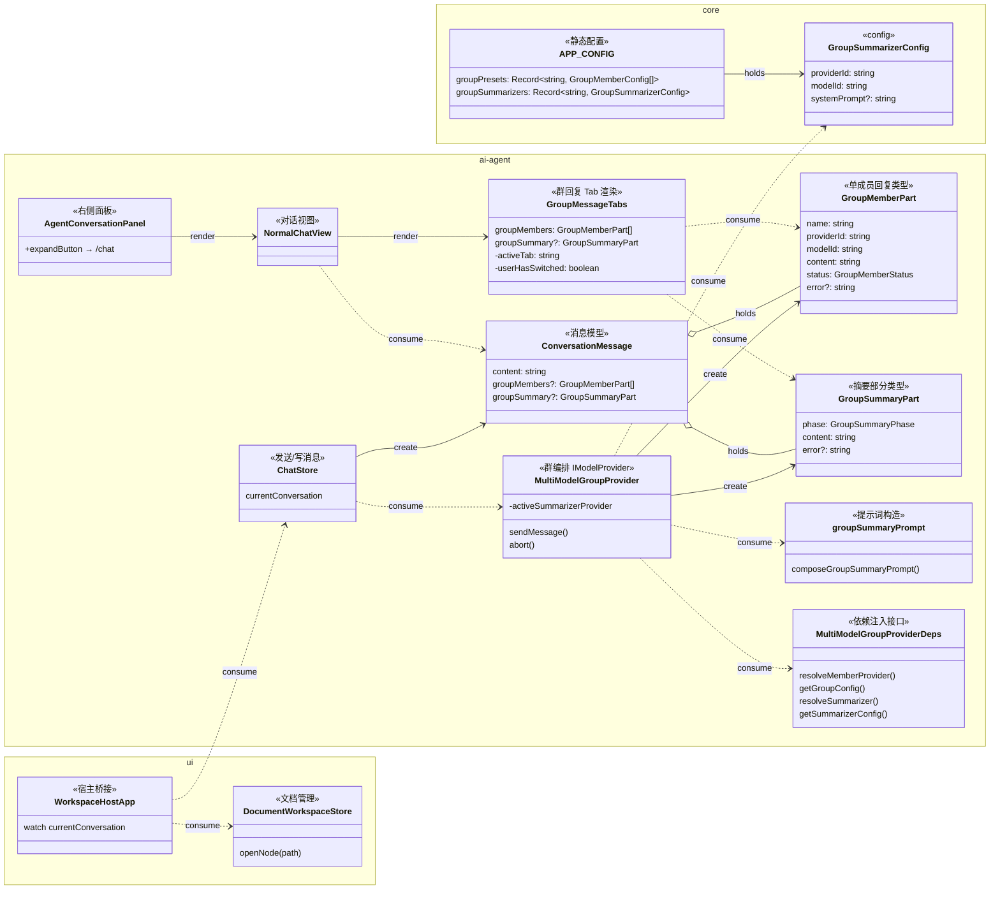

## 背景

群组对话（`MultiModelGroupProvider`）目前将所有成员回复合并为一条 assistant 消息，以 `### {memberName}` Markdown 标题分隔，并通过标准的 `onUpdate({ text })` 回调发出。聊天 store 将合并后的文本直接写入 `ConversationMessage.content`，`NormalChatView` 通过 `MarkdownContent` 渲染。消息模型中没有按成员的结构化字段，没有摘要步骤，也没有标签页 UI。

现有的 Compare（对比）功能（`CompareChatView` + `AnalysisGrid`）为并排模型输出和结构化分析提供了有用的参考，但它是一个独立的单次 A/B 工作流，而非多轮群组对话，无法直接复用。

右侧面板 `AgentConversationPanel` 已有"展开到全屏"按钮（`agent-conversation-expand` → `switchWorkspace('/chat')`），但全屏视图中没有对称的"折叠到面板"按钮。`Conversation` 模型已存储 `documentIds`，但 UI 层未使用该字段在对话切换时自动打开关联文档。

## 目标 / 非目标

**目标：**
- 将群组轮次渲染为标签页卡片：`Summary` 标签（完成后默认）+ 每个成员一个标签。
- 在 ≥2 个成员完成时，通过预设配置的摘要模型自动生成结构化摘要（共识 / 互补 / 分歧）。
- 实时流式传输成员回复和摘要输出；呈现每成员状态指示器。
- 单成员轮次优雅降级为普通气泡。
- 在全屏聊天头部新增对称的"折叠到面板"按钮。
- 对话/工作区切换时自动打开第一个关联文档（`documentIds[0]`）。
- 所有新字段均为可选，与现有对话向后兼容。

**非目标：**
- 修改 DOM provider 链、群组成员路由或 `@mention` 分发逻辑。
- 多轮编排、自动规划或人设模板。
- 修改 Compare 功能。

## 决策

### D1 — 以可选结构化字段扩展 `ConversationMessage`（增量）

**决策：** 向 `ConversationMessage` 添加可选的 `groupMembers?: GroupMemberPart[]` 和 `groupSummary?: GroupSummaryPart`。保留 `content` 作为供搜索/导出/遗留渲染使用的扁平纯文本回退。

**理由：** 避免引入包装容器类型；无这些字段的消息通过现有 `MarkdownContent` 路径渲染，不受影响。存储大小的增加在可接受范围内。

**备选方案：** 新建 `GroupConversationMessage` 子类型——已拒绝，因为这需要在所有消息消费者（聊天 store、搜索、导出、历史序列化）处进行判别联合处理。

**涉及文件：**
- `plugins/ai-agent/src/interfaces/Conversation.ts` — 向 `ConversationMessage` 添加 `groupMembers?` 和 `groupSummary?`
- `plugins/ai-agent/src/interfaces/IModelProvider.ts` — 向 `ProviderStreamUpdate` 和 `ProviderSendResult` 添加相同的可选字段

**类型签名：**
```ts
// Conversation.ts
export type GroupMemberStatus = 'pending' | 'streaming' | 'done' | 'error';
export type GroupSummaryPhase = 'waiting' | 'streaming' | 'done' | 'error';

export interface GroupMemberPart {
  name: string;
  providerId: string;
  modelId: string;
  content: string;
  status: GroupMemberStatus;
  error?: string;
}

export interface GroupSummaryPart {
  phase: GroupSummaryPhase;
  content: string;
  error?: string;
}

// ConversationMessage 新增：
groupMembers?: GroupMemberPart[];
groupSummary?: GroupSummaryPart;
```

---

### D2 — `MultiModelGroupProvider` 内联构建并流式传输 `groupMembers[]`

**决策：** 将当前的每成员文本缓冲区（`Map<string, string>`）替换为流经 `onUpdate` 的 `GroupMemberPart[]` 数组。`Promise.all(memberTasks)` 完成后，若成员数 ≥2，则解析预设摘要器并将其输出流式写入 `groupSummary`。

**涉及文件：**
- `plugins/ai-agent/src/providers/model/MultiModelGroupProvider.ts` — 重构 `sendMessage`，添加摘要器调用
- `plugins/ai-agent/src/group/groupTypes.ts` — 添加 `GroupMemberPart`、`GroupSummaryPart`（也从 `Conversation.ts` 接口导出）
- `plugins/ai-agent/src/group/groupSummaryPrompt.ts`（新建）— 构造摘要器提示词
- `plugins/ai-agent/src/runtime/createModelProviderRuntime.ts` — 注入 `resolveSummarizer` 依赖；更新 `getGroupConfig` 返回类型

**关键方法签名：**
```ts
// MultiModelGroupProviderDeps（groupTypes.ts 或 groupProvider 依赖）
interface MultiModelGroupProviderDeps {
  resolveMemberProvider(providerId: string): IModelProvider;
  getGroupConfig(presetModelId?: string): GroupConfig;
  resolveSummarizer(presetModelId?: string): IModelProvider | null; // null = 无摘要器
  getSummarizerConfig(presetModelId?: string): GroupSummarizerConfig | null;
}

// groupSummaryPrompt.ts
export function composeGroupSummaryPrompt(
  members: GroupMemberPart[],
  systemPrompt?: string
): string;
```

**中止：** `abort()` 通过共享的 `AbortController` 式标志取消所有正在运行的成员 provider 和摘要器 provider（与 `activeMemberProviders` 中的现有模式一致）。

---

### D3 — `APP_CONFIG` 中的预设级摘要器配置

**决策：** 在 `packages/core/config.ts` 的 `APP_CONFIG` 中添加 `groupSummarizers: Record<presetId, GroupSummarizerConfig>`，与 `groupPresets` 并列。

```ts
// packages/core/config.ts
export interface GroupSummarizerConfig {
  providerId: string;
  modelId: string;
  systemPrompt?: string;
}
// APP_CONFIG 新增：
groupSummarizers: Record<string, GroupSummarizerConfig>;
```

**理由：** 将摘要器与预设绑定（切换预设 → 切换摘要器），无需额外 UI。

---

### D4 — `GroupMessageTabs.vue` 作为新渲染组件

**决策：** 创建新的 `GroupMessageTabs.vue` 组件，在 `NormalChatView` 中当 `message.groupMembers?.length > 0`（`> 1` 时显示 Summary 标签）时使用。

**涉及文件：**
- `plugins/ai-agent/src/components/GroupMessageTabs.vue`（新建）
- `plugins/ai-agent/src/views/NormalChatView.vue` — 条件渲染

**`GroupMessageTabs` 属性/行为：**
```ts
defineProps<{
  groupMembers: GroupMemberPart[];
  groupSummary?: GroupSummaryPart;
}>();
```
- 本地 `activeTab: string`（成员名称或 `'summary'`）。
- 挂载时默认第一个成员的名称。
- 监听 `groupSummary.phase`：当其变为 `'done'` 且 `userHasSwitched === false` 时，设置 `activeTab = 'summary'`。
- `@成员` chip 点击：`activeTab = memberName`。
- 当 `groupMembers.length === 1` 时隐藏 Summary 标签（不渲染 chip）。
- 降级：当 `groupMembers.length === 1` 时，`NormalChatView` 使用 `groupMembers[0].content` 渲染普通 `MarkdownContent` 气泡（不使用 `GroupMessageTabs`）。

---

### D5 — 对称的面板 ↔ 全屏切换

**决策：** 在全屏聊天头部（`NormalChatView.vue` 工具栏区域）添加"折叠到面板"按钮。该按钮发出 `request-workspace-switch`，路径为 `'/'`。这与 `AgentConversationPanel` 中现有的展开按钮对称。

**涉及文件：**
- `plugins/ai-agent/src/views/NormalChatView.vue` — 在全屏上下文中添加折叠按钮（通过 prop 或路由检测）
- `plugins/ai-agent/src/components/AgentConversationPanel.vue` — 确保图标/提示语言与新折叠按钮保持一致

---

### D6 — 通过 `WorkspaceHostApp` 监听器实现文档跟随

**决策：** 在 `packages/ui/src/views/WorkspaceHostApp.vue` 中添加对 `chatStore.currentConversation` 的 `watch`。当其变化且 `conversation.documentIds?.[0]` 有值时，解析文档路径（通过现有的 `documentWorkspace` id-to-path 解析）并调用 `documentWorkspace.openNode(path)`。无关联或文档未找到时为空操作。

**涉及文件：**
- `packages/ui/src/views/WorkspaceHostApp.vue` — 添加监听器
- `packages/ui/src/store/documentWorkspace.ts` — 复用现有的 `openNode(path)`（无新 API）

**理由：** `WorkspaceHostApp` 是唯一同时能访问 `chatStore` 和 `documentWorkspace` 的层。这与 `WorkspaceRightPane` 中已有的 `OpenConversationRequest` 处理模式相同。

## 类图



## 风险 / 权衡

- **[风险] `@成员` 归因是提示词的软约定** → 摘要模型可能不会始终输出 `@MemberName` token。缓解措施：`GroupMessageTabs` 中提供纯 Markdown 回退——若未发现 `@` chips，则以原始 Markdown 渲染摘要。在 `composeGroupSummaryPrompt` 中添加明确的格式指令。

- **[风险] 摘要器为每个群组轮次增加延迟和成本** → 仅在 ≥2 个成员时触发；预设级配置让运营者可选择轻量模型。用户立即看到流式输出，因此感知延迟极低。

- **[风险] `groupMembers`/`groupSummary` 增大持久化消息体积** → 对群组轮次可接受；`content` 回退确保旧对话仍可读。

- **[风险] `WorkspaceHostApp` 文档跟随在每次对话切换时触发** → 守卫条件：仅当 `documentIds[0]` 与当前打开的文档路径不同时才调用 `openNode`。

## 迁移计划

所有变更均为增量可选字段，无需数据迁移。不含 `groupMembers` 的现有对话在 `NormalChatView` 中继续通过现有 `MarkdownContent` 渲染路径处理，不受影响。

## 待解问题

- 摘要模型是否应仅限于 API 型 provider（非 DOM 自动化 provider），以避免与外部站点自动化的时序和生命周期问题？当前假设：是——`resolveSummarizer` 应跳过 DOM provider。
- "折叠到面板"按钮是否仅在全屏视图从面板展开进入时显示（即用户处于面板展开的 `/chat` 路由），还是始终显示？当前假设：在 `/chat` 路由中始终显示。
