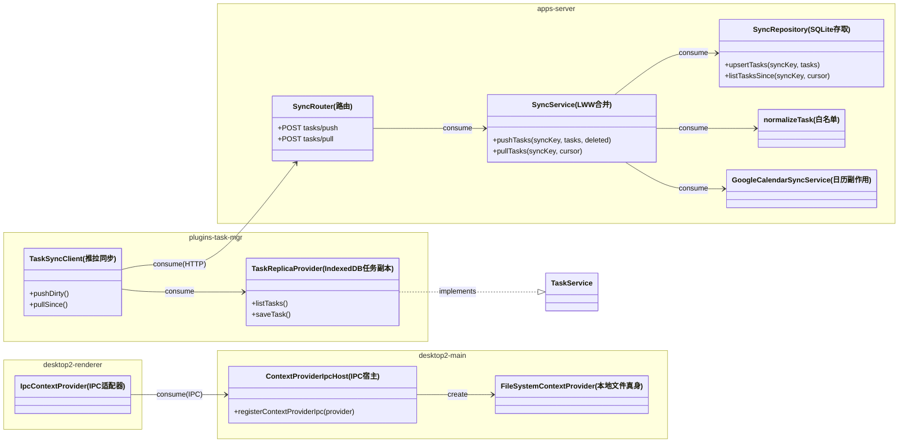

English | [Chinese](design.zh-CN.md)

## Context

Architecture and decision log: `docs/online-refactor.md` (D1–D9). Current state:

- Conversations already follow a local-first pattern: renderer IndexedDB (`SyncStorageProvider` + `FetchSyncTransport`) push/pull to a server SQLite keyed by `syncKey` + cursor. The sync target URL is build-time configurable (`VITE_SYNC_BASE_URL`, absolute URLs supported).
- Tasks are server-side only: `FileSystemTaskProvider` reads/writes `<knowledgeRoot>/.chatprism/tasks.json`; clients fetch via `/api/context/get-tasks` per request. No offline copy; single-file storage conflicts under Dropbox multi-writer.
- Desktop renderer loads from the local server origin (same-origin `/api/*`); documents go through the local server's `FileSystemContextProvider`. `conversationQueryProvider` on that provider is optional (nullable) — verified.
- The server has no global auth; network exposure is handled via Tailscale.
- **Phase 0 is already deployed**: VPS up, Tailscale connected, Dropbox bidirectional sync of `AgentSpace` between Mac and VPS, web2 hosted by the VPS.

## Goals / Non-Goals

**Goals:**

- One hub (the VPS) owns all record data (conversations + tasks); every client holds an offline replica.
- From phase 1 onward, the Mac local server leaves the daily-use path; it is retained only as a development simulator for local web2/API work, while desktop daily use points at the VPS. Local files remain, synced via Dropbox.
- Tasks leave the file domain: per-record sync, LWW conflict resolution, offline task views on all clients.
- Desktop regains offline capability in phase 3: local-bundle renderer, IPC file access to the local Dropbox replica, remote-hub sync.
- Phase 4 keeps phone web2 in a PWA-ready state: offline app shell, read-only recent-document cache, and manifest code remain, but this change now accepts phone online mode only and defers real-phone offline/standalone validation.
- Codex migration is not part of this change's acceptance for now; this change only requires stable sync/context behavior plus the NAS deployment path.

**Non-Goals:**

- Phase 5 (global search/RAG) — **explicitly not implemented**; design archived in `docs/online-refactor.md`.
- App-level authentication (Tailscale covers single-user security).
- Materialized projections for external agents (D8 level 3) — future change.
- Conversation storage changes — the existing mechanism is kept as-is.

## Decisions

### D-1. Task sync reuses the conversation sync pattern, as separate endpoints

New task resources get their own endpoints under the existing sync router (`/api/sync/tasks/push`, `/api/sync/tasks/pull`) rather than overloading conversation payloads — no breaking change to existing clients, independent cursors per resource type.

*Alternative considered*: generic multi-resource envelope on the existing push/pull — rejected: breaks the deployed conversation contract and complicates the normalizer.

Files / signatures:

| File | Change |
|---|---|
| `apps/server/src/schema.ts` | new table `sync_tasks(sync_key, task_id, payload, updated_at, deleted, cursor)` + migration |
| `apps/server/src/types/sync.ts` | `normalizeTask(input: unknown): SyncTaskRecord` — whitelist normalizer (mirror of `normalizeConversation`) |
| `apps/server/src/repositories/syncRepository.ts` | `upsertTasks(syncKey, tasks): void`, `listTasksSince(syncKey, cursor): { tasks, nextCursor }` |
| `apps/server/src/services/syncService.ts` | `pushTasks(syncKey, tasks, deleted): PushResult`, `pullTasks(syncKey, cursor): PullResult` — LWW by `updatedAt` per task id |
| `apps/server/src/routes/sync.ts` | register the two task endpoints |

### D-2. Client task replica lives in `plugins/task-mgr`, transport pattern copied from ai-agent

`task-mgr` gets its own IndexedDB replica + sync client instead of coupling to ai-agent's `SyncStorageProvider` (that class is conversation-shaped: compare payloads, archive hooks). The UI-facing `TaskService` contract is preserved so views don't change.

*Alternative considered*: generalize `SyncStorageProvider` to arbitrary records — rejected for this change: high blast radius on stable conversation code; revisit if a third record type appears.

Files / signatures:

| File | Change |
|---|---|
| `plugins/task-mgr/src/replica/TaskReplicaProvider.ts` (new) | implements the existing `TaskService` API against localforage/IndexedDB; marks records dirty on write |
| `plugins/task-mgr/src/replica/TaskSyncClient.ts` (new) | `pushDirty(): Promise<void>`, `pullSince(): Promise<void>`; cadence (decided): push on every mutation + startup compensation push, incremental pull at startup, **no periodic timer**; HTTP via injected `fetchImpl` |
| `plugins/task-mgr` runtime wiring | provider selection: replica-backed when sync base URL configured; HTTP fallback retained behind a flag during rollout |

### D-3. Google Calendar sync moves to the hub, triggered on task push

Calendar side effects execute where the truth lives. The hub's task push handler invokes `GoogleCalendarSyncService` (already env-driven) after normalization; `FileSystemTaskProvider` loses its calendar wiring.

### D-4. One-time `tasks.json` migration on hub startup

Same pattern as `runDocumentIdMigration` in `apps/server/src/app.ts`: on startup, if meta flag unset, import `<knowledgeRoot>/.chatprism/tasks.json` into `sync_tasks`, write meta flag, leave the file in place (read-only legacy). `.chatprism/` exits the file domain contract.

### D-5. Desktop file access goes IPC; renderer loads from local bundle

Electron main hosts `FileSystemContextProvider` (`conversationQueryProvider: null`; document-linked conversation lists are served client-side from the IndexedDB replica). A thin IPC host maps provider methods to `ipcMain.handle` channels; the renderer gets an `IpcContextProvider implements IContextProvider`. Renderer is loaded via `loadFile`/custom protocol instead of the server origin.

*Alternative considered*: keep local server, auto-spawn from main — rejected (extra process, port, and HTTP hop for purely local work). Note the local server already stops in phase 1; between phases 1 and 3 the desktop relies on the VPS online, and this phase restores offline capability via IPC against the local Dropbox replica.

Files / signatures:

| File | Change |
|---|---|
| `apps/desktop2/main/contextProviderIpc.ts` (new) | `registerContextProviderIpc(provider: IContextProvider): void` — one `ipcMain.handle('context:<method>', …)` per interface method |
| `apps/desktop2/preload/…` | expose `window.jarvisContext` bridge (mirrors `IContextProvider` methods) and `window.jarvisFetch` (see D-6) |
| `apps/desktop2/renderer` runtime wiring (new `IpcContextProvider`) | `class IpcContextProvider implements IContextProvider` delegating to the bridge |
| `apps/desktop2/main/index.ts` | renderer loading switches from server origin to local bundle; import (`BilibiliTranscriptService`) exposed over IPC |

### D-6. Cross-origin sync solved by injected fetch through main, not CORS

`FetchSyncTransport` already accepts `fetchImpl`. Desktop injects a preload-bridged fetch that executes in main (`net.fetch`) for hub URLs — no CORS involvement, no `Origin: null` edge cases from file/custom-protocol pages, and hub CORS config stays untouched.

*Alternative considered*: hub `corsAllowlist` for the desktop origin — rejected: custom-protocol origins are awkward to allowlist and leak deployment detail into server config.

### D-7. web2 PWA via vite-plugin-pwa (Workbox)

The offline shell uses `vite-plugin-pwa` with Workbox precaching for the app shell (hashed assets + index.html) and a runtime read-only cache (stale-while-revalidate) for document read responses; a web manifest enables add-to-home-screen. Caches are projections — eviction is harmless, truth stays on the hub.

*Alternative considered*: hand-rolled service worker — rejected: Workbox solves precache manifest generation and cache versioning for free; custom SW code is a maintenance liability.

Files / signatures:

| File | Change |
|---|---|
| `apps/web2/vite.config.ts` | add `VitePWA({...})` plugin config (precache app shell, runtime caching rule for `/api/context` document reads) |
| `apps/web2/public/` | manifest icons; `index.html` manifest link/meta |

### Class diagram

Task UI keeps consuming `TaskService`; only the implementation behind it changes. `IpcContextProvider` is a pure adapter — all file semantics stay in `FileSystemContextProvider`.

## Risks / Trade-offs

- [Task LWW loses concurrent field edits (last write wins whole record)] → acceptable for single user; per-task granularity already shrinks the window; revisit with field-level merge only if real losses observed.
- [Two task providers coexist during rollout (HTTP vs replica)] → feature flag defaults to replica after migration verified; HTTP path removed in cleanup task.
- [IPC surface drift vs `IContextProvider`] → generate channel list from the interface type; add a contract test that every interface method has a registered channel.
- [Desktop offline renderer regression (no server origin)] → e2e: launch desktop with network disabled, assert documents and task views render.
- [tasks.json edited externally after migration] → file becomes legacy read-only; document in `my-README.md`; hub ignores it post-migration.

## Migration Plan

1. Phase 1 (config): route daily-use clients to the VPS (phone web2 same-origin; Mac via browser or a VPS-pointed desktop build), and keep the Mac local server only for development simulation of the VPS/web2 API flow; verify conversations converge on hub SQLite, and script the amd64 deployment flow for the NAS-hosted server.
2. Phase 2: deploy schema migration → deploy endpoints → ship replica provider behind flag → run tasks.json import → flip flag → relocate calendar sync.
3. Phase 3: ship IPC provider + local bundle loading behind a desktop build flag; desktop offline e2e green before removing the flag.
4. Phase 4: ship PWA code (service worker + manifest + doc cache); accept usable phone online mode in this change, and defer real-phone offline validation to a future change.
5. Rollback: each phase is independently revertible (flag off / point sync URL back / restart local server as emergency fallback — code retained).

## Open Questions

None.

(Resolved: VPS/phase-0 environment is already deployed; task sync cadence = push on mutation + startup compensation, no periodic timer. Codex migration was removed from this change's acceptance.)
