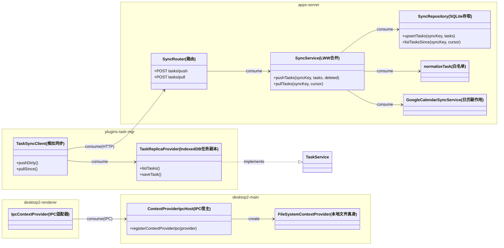

[English](design.md) | 中文

## Context(背景)

架构与决策记录:`docs/online-refactor.md`(D1–D9)。现状:

- 会话已是 local-first:renderer IndexedDB(`SyncStorageProvider` + `FetchSyncTransport`)按 `syncKey` + cursor 向 server SQLite push/pull;sync 目标 URL 构建期可配(`VITE_SYNC_BASE_URL`,支持绝对地址)。
- 任务仅存服务端:`FileSystemTaskProvider` 读写 `<knowledgeRoot>/.chatprism/tasks.json`;客户端逐请求经 `/api/context/get-tasks` 获取。无离线副本;单文件在 Dropbox 多写者下易冲突。
- 桌面 renderer 从本地 server origin 加载(同源 `/api/*`);文档经本地 server 的 `FileSystemContextProvider`。该 provider 的 `conversationQueryProvider` 为可空可选项(已验证)。
- server 无全局鉴权;网络暴露由 Tailscale 解决。
- **阶段 0 已部署完成**:VPS 就绪、Tailscale 已联通、`AgentSpace` 经 Dropbox 在 Mac 与 VPS 间双向同步、VPS 托管 web2。

## Goals / Non-Goals(目标/非目标)

**目标:**

- 唯一 hub(VPS)独占全部记录数据(会话 + 任务);每个客户端持离线副本。
- 自阶段 1 起 Mac 本地 server 退出日常使用链路,仅保留为本地 web2/API 开发时的 VPS 模拟器;desktop 日常使用直连 VPS。本地文件保留,经 Dropbox 同步。
- 任务脱离文件域:按记录同步、LWW 冲突解决、所有端任务视图离线可用。
- 阶段 3 桌面恢复离线能力:本地打包 renderer、IPC 访问本地 Dropbox 副本、sync 指向远程 hub。
- 阶段 4 保留手机 web2 的 PWA 代码就绪状态:离线应用壳 + 最近文档只读缓存 + manifest 仍保留,但本次 change 最终只验收到手机在线模式可用;真机离线/standalone 后移。
- `codex` 迁移暂不纳入本次变更验收;当前只要求 sync/context 与 NAS 部署链路稳定。

**非目标:**

- 阶段 5(全局搜索/RAG)——**明确不实施**;设计存档于 `docs/online-refactor.md`。
- 应用级鉴权(单人场景由 Tailscale 覆盖)。
- 面向外部 agent 的物化投影(D8 第 3 级)——后续 change。
- 会话存储改动——现有机制原样保留。

## Decisions(决策)

### D-1. 任务同步复用会话同步模式,但走独立端点

任务资源在既有 sync 路由下新增独立端点(`/api/sync/tasks/push`、`/api/sync/tasks/pull`),不复用会话的 payload——对已部署客户端零破坏,各资源类型 cursor 独立。

*备选*:在既有 push/pull 上做多资源信封——否决:破坏已上线的会话契约,normalizer 复杂化。

文件/签名:

| 文件 | 改动 |
|---|---|
| `apps/server/src/schema.ts` | 新表 `sync_tasks(sync_key, task_id, payload, updated_at, deleted, cursor)` + 迁移 |
| `apps/server/src/types/sync.ts` | `normalizeTask(input: unknown): SyncTaskRecord` —— 白名单 normalizer(对照 `normalizeConversation`) |
| `apps/server/src/repositories/syncRepository.ts` | `upsertTasks(syncKey, tasks): void`、`listTasksSince(syncKey, cursor): { tasks, nextCursor }` |
| `apps/server/src/services/syncService.ts` | `pushTasks(syncKey, tasks, deleted): PushResult`、`pullTasks(syncKey, cursor): PullResult` —— 按 task id 依 `updatedAt` LWW |
| `apps/server/src/routes/sync.ts` | 注册两个任务端点 |

### D-2. 客户端任务副本放在 `plugins/task-mgr`,传输模式抄自 ai-agent

`task-mgr` 自建 IndexedDB 副本 + 同步客户端,不耦合 ai-agent 的 `SyncStorageProvider`(该类是会话形状:compare 负载、归档钩子)。UI 侧 `TaskService` 契约保持不变,视图零改动。

*备选*:把 `SyncStorageProvider` 泛化为任意记录——本次否决:对稳定的会话代码爆炸半径太大;出现第三种记录类型时再议。

文件/签名:

| 文件 | 改动 |
|---|---|
| `plugins/task-mgr/src/replica/TaskReplicaProvider.ts`(新) | 以 localforage/IndexedDB 实现既有 `TaskService` API;写入时标记 dirty |
| `plugins/task-mgr/src/replica/TaskSyncClient.ts`(新) | `pushDirty(): Promise<void>`、`pullSince(): Promise<void>`;节奏(已定):**变更即推 + 启动补推**,启动时增量拉取,**不设周期定时器**;HTTP 经注入的 `fetchImpl` |
| `plugins/task-mgr` 运行时装配 | provider 选择:配置了 sync base URL 时用副本型;过渡期 HTTP 路径留在开关后 |

### D-3. Google Calendar 同步移至 hub,由任务 push 触发

日历副作用在真身所在处执行。hub 的任务 push 处理器在 normalize 后调用 `GoogleCalendarSyncService`(已支持 env 驱动);`FileSystemTaskProvider` 摘除日历接线。

### D-4. hub 启动时一次性迁移 `tasks.json`

沿用 `apps/server/src/app.ts` 中 `runDocumentIdMigration` 的模式:启动时若 meta 标记未置,将 `<knowledgeRoot>/.chatprism/tasks.json` 导入 `sync_tasks`,写 meta 标记,原文件保留(只读遗留)。`.chatprism/` 退出文件域契约。

### D-5. 桌面文件访问 IPC 化;renderer 本地打包加载

Electron main 持有 `FileSystemContextProvider`(`conversationQueryProvider: null`;文档关联会话列表改由客户端 IndexedDB 副本提供)。薄 IPC 宿主把 provider 方法映射为 `ipcMain.handle` 通道;renderer 侧为 `IpcContextProvider implements IContextProvider`。renderer 由 `loadFile`/自定义协议加载,不再依赖 server origin。

*备选*:保留本地 server 并由 main 自动拉起——否决(纯本地操作多一个进程、端口与 HTTP 跳)。注意本地 server 在阶段 1 即停运;阶段 1–3 之间桌面在线依赖 VPS,本阶段以 IPC 读本地 Dropbox 副本恢复离线能力。

文件/签名:

| 文件 | 改动 |
|---|---|
| `apps/desktop2/main/contextProviderIpc.ts`(新) | `registerContextProviderIpc(provider: IContextProvider): void` —— 接口每个方法一个 `ipcMain.handle('context:<method>', …)` |
| `apps/desktop2/preload/…` | 暴露 `window.jarvisContext` 桥(镜像 `IContextProvider` 方法)与 `window.jarvisFetch`(见 D-6) |
| `apps/desktop2/renderer` 运行时装配(新 `IpcContextProvider`) | `class IpcContextProvider implements IContextProvider`,委托给桥 |
| `apps/desktop2/main/index.ts` | renderer 加载从 server origin 切到本地打包;导入(`BilibiliTranscriptService`)经 IPC 暴露 |

### D-6. 跨域 sync 用 main 代理 fetch 解决,不用 CORS

`FetchSyncTransport` 已支持注入 `fetchImpl`。桌面注入经 preload 桥接、在 main 中执行(`net.fetch`)的 fetch 用于 hub URL——完全绕开 CORS,规避 file/自定义协议页面的 `Origin: null` 边角,hub 的 CORS 配置零改动。

*备选*:hub `corsAllowlist` 放行桌面 origin——否决:自定义协议 origin 难以白名单化,且把部署细节泄漏进 server 配置。

### D-7. web2 PWA 采用 vite-plugin-pwa(Workbox)

离线壳用 `vite-plugin-pwa` + Workbox 预缓存应用壳(哈希资产 + index.html),文档读取响应用运行时只读缓存(stale-while-revalidate);web manifest 支持添加到主屏幕。缓存皆为投影——被驱逐无害,真身在 hub。

*备选*:手写 service worker——否决:Workbox 免费解决预缓存清单生成与缓存版本化;自研 SW 是维护负担。

文件/签名:

| 文件 | 改动 |
|---|---|
| `apps/web2/vite.config.ts` | 增加 `VitePWA({...})` 插件配置(预缓存应用壳、`/api/context` 文档读取的运行时缓存规则) |
| `apps/web2/public/` | manifest 图标;`index.html` manifest 链接/meta |

### 类图

任务 UI 继续消费 `TaskService`,只换其背后实现;`IpcContextProvider` 是纯适配器,文件语义全部留在 `FileSystemContextProvider`。

## Risks / Trade-offs(风险/权衡)

- [任务 LWW 整记录覆盖并发字段编辑] → 单人可接受;单任务粒度已缩小窗口;确有丢失再考虑字段级合并。
- [过渡期两个任务 provider 并存(HTTP vs 副本)] → 迁移验证后开关默认副本;清理任务中移除 HTTP 路径。
- [IPC 面与 `IContextProvider` 漂移] → 由接口类型生成通道清单;契约测试断言每个接口方法都有注册通道。
- [桌面离线渲染回归(无 server origin)] → e2e:断网启动桌面,断言文档与任务视图可渲染。
- [迁移后 tasks.json 被外部编辑] → 文件降为只读遗留;写入 `my-README.md`;hub 迁移后忽略之。

## Migration Plan(迁移计划)

1. 阶段 1(配置):将日常使用端切到 VPS(手机 web2 同源;Mac 经浏览器或指向 VPS 的桌面构建),并将 Mac 本地 server 仅保留为开发态的 VPS/web2 API 模拟器;验证会话在 hub SQLite 收敛,并将 NAS 上的 amd64 server 部署流程脚本化。
2. 阶段 2:schema 迁移 → 部署端点 → 副本 provider(开关后)→ 执行 tasks.json 导入 → 切开关 → Calendar 同步迁移。
3. 阶段 3:IPC provider + 本地打包加载(桌面构建开关后)上线;桌面离线 e2e 通过后移除开关。
4. 阶段 4:PWA 代码上线(service worker + manifest + 文档缓存);当前只验收手机在线模式,真机离线验证转移到后续 change。
5. 回滚:各阶段独立可回退(关开关 / sync URL 指回 / 紧急时重启本地 server 兜底——代码保留)。

## Open Questions(待决问题)

无。

(已解决:VPS/阶段 0 环境已部署;任务同步节奏 = 变更即推 + 启动补推,不设周期定时器。`codex` 迁移从本次验收中移除。)
